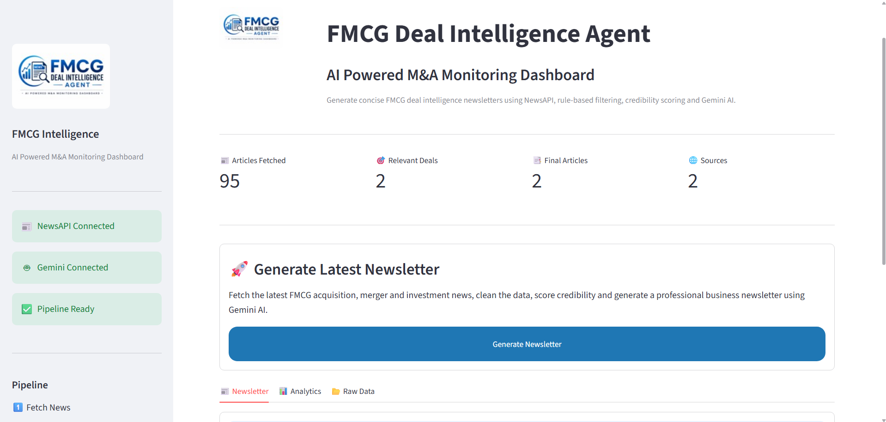
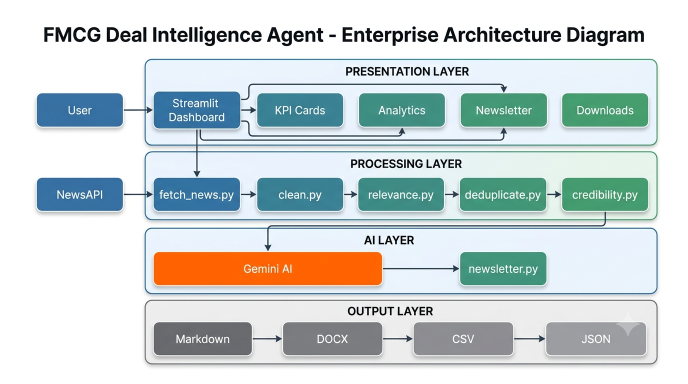

# 📰 FMCG Deal Intelligence Agent

An AI-powered business intelligence application that automatically collects, filters, scores, and summarizes recent FMCG merger, acquisition, and investment news into a concise executive newsletter using Gemini AI.


## Problem Statement

Business professionals spend considerable time tracking FMCG mergers, acquisitions, investments, and strategic partnerships from multiple news sources.

This project automates the entire workflow by:

- Collecting recent FMCG deal news
- Cleaning and removing duplicate articles
- Filtering relevant deal announcements
- Scoring source credibility
- Generating an executive newsletter using Gemini AI
- Exporting the results into Markdown, Word, CSV, and JSON formats


## Features

- Live News Collection using NewsAPI
- Data Cleaning
- Rule-Based FMCG Relevance Filtering
- Near Duplicate Detection using RapidFuzz
- Source Credibility Scoring
- AI Newsletter Generation using Gemini
- Streamlit Dashboard
- Export to Markdown
- Export to Word (.docx)
- Export to CSV
- Export to JSON

## Tech Stack

| Technology | Purpose |
|------------|---------|
| Python | Backend |
| Streamlit | Dashboard |
| NewsAPI | News Collection |
| Gemini AI | Newsletter Generation |
| Pandas | Data Processing |
| RapidFuzz | Duplicate Detection |
| python-docx | Word Export |


# Dashboard




## Architecture




## Pipeline

NewsAPI

↓

Data Cleaning

↓

Relevance Filtering

↓

Duplicate Removal

↓

Credibility Scoring

↓

Gemini AI

↓

Newsletter Generation

↓

Exports (CSV / JSON / DOCX)


## Folder Structure

```text
news-agent/

├── app.py
├── requirements.txt
├── README.md
│
├── assets/
│
├── src/
│   ├── fetch_news.py
│   ├── clean.py
│   ├── relevance.py
│   ├── deduplicate.py
│   ├── credibility.py
│   ├── newsletter.py
│   ├── exporter.py
│   ├── ui.py
│   └── styles.py
│
├── data/
├── output/
└── .env
```


## Installation

```bash
git clone https://github.com/YOUR_USERNAME/fmcg-deal-intelligence-agent.git

cd fmcg-deal-intelligence-agent

python -m venv venv

venv\Scripts\activate

pip install -r requirements.txt
```


## Run

```bash
python -m streamlit run app.py
```


## Output Files

After execution the application generates:

- newsletter.md
- newsletter.docx
- scored_news.csv
- scored_news.json


## Future Improvements

- Semantic relevance filtering using LLM validation
- Multi-language news support
- Sentiment analysis
- Interactive analytics dashboard
- Scheduled newsletter generation
- Email delivery


## Author

Vinshi Jain

Built as part of an AI Engineering assignment demonstrating an end-to-end intelligent news aggregation and summarization pipeline.